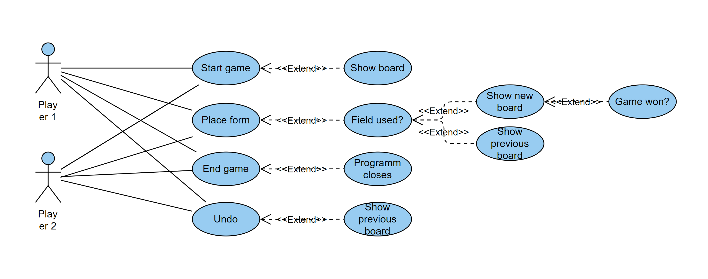
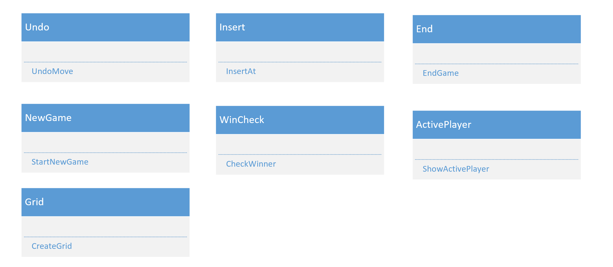
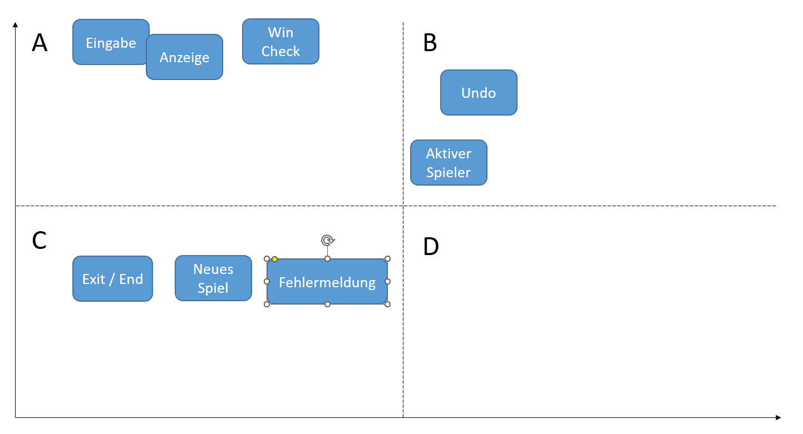

# Tic Tac Toe

*Julia Hüttenmoser, Dean Eichmann, Manuel Brülisauer* 

*Abg*
## Inhalt 
- [Informationen](#informationen)
    - [Links](#links)
- [Start und Planung](#start)
    - [Planung](#plan)
    - [Start](#star)
- [Sprint 1](#sprint1)
    - [Sprintziele](#goal1)
    - [Sprint](#dok1)
    - [Review](#rev1)
    - [Retroperspektive](#retro1)
- [Sprint 2](#sprint2)
    - [Sprintziele](#goal2)
    - [Sprint](#dok2)
    - [Review](#rev2)
    - [Retroperspektive](#retro2)
- [Sprint 3](#sprint3)
    - [Sprintziele](#goal3)
    - [Sprint](#dok3)
    - [Review](#rev3)
    - [Retroperspektive](#retro3)

<a id="iformationen"></a>
## Informationen
Dies ist unser Vertiefungsprojekt für das Modul V320.  
Das Thema des Projektes ist Tic Tac Toe, das auf einem normalen 3x3 Feld gespielt wird,   
wobei man gewinnt wenn man der erste mit 3 gleichen Zeichen auf der Horizonalen, Vertikalen oder Diagonalen ist.

<a id="links"></a>
### Links
Hier sehen Sie die Links zu dem Projekt auf Github sowie für Azure DevOps.

>[Github Repository](https://github.com/mabruelisauer/TicTacToe)  
[Azure Scrum](https://dev.azure.com/JuliaHuettenmoser/tictactoe) (Nur mit Zugriff)

<a id="start"></a>
## Start und Planung
<a id="plan"></a>
### Planung
Am Anfang des Projektes mussten wir zuerst Planen, wie wir das Projekt angehen sollen bzw.  
wie wir Anfangen wollen, was wir in welchem Sprint machen, was überhaupt zu machen ist, etc.  
Zum Glück gab uns die [Vorgabe des Projektes](./Zusatz/Projektauftrag_TicTacToe.pdf) bereits einen guten Einblick.
<a id="star"></a>
### Start
Als erstes haben wir direkt ein Repository und das Azure DevOps Projekt erstellt.  
Nachdessen konnten Dean und Julia direkt die **Product Vision** und die **User Stories** erstellen, die wir aus 
den funktionalen Anforderungen der Beschreibung des Projektes genommen haben. 

Währenddessen hat Manuel das **UseCase-Modell** erstellt:



Dann hat Dean eine provisorische Priorisierung mit einem **Wert/Risiko Diagramm** kreeiert,
während Julia versucht hat ein **Klassendiagramm** zu erstellen, jedoch sind wir zum Schluss,
gekommen, dass wir lieber einmal mit dem Code anfangen und im Nachhinein das Diagramm für
die Übersicht erstellen, da es uns so leichter wirkt. Es ist sehr schwierig ein Diagramm dazu
zu erstellen, wenn man noch keine Ahnung hat, was für Klassen, Methoden und Properties
man überhaupt braucht.  
Trotzdessen ist hier ihr Prototyp zum Klassendiagramm:



Nachdem wir uns dazu entschlossen haben, haben wir uns gemeinsam um die Priorisierung geeinigt.  
Dies war die schlussendliche Priorisierung die man auch auf Azure finden kann (2,2,3 anstatt ABC):



<a id="sprint1"></a>
## Sprint 1
<a id="goal1"></a>
### Sprintziele
Im ersten Sprint wollen wir zuerst uns organisieren und das ganze Projekt planen. Nachdem wir damit fertig
sind wollen wir das Grid für das Tic Tac Toe machen und eine Anzeige für das Grid.  
Also kurz:
- Organisation/ Planung
- Grid
- Anzeige für Grid

<a id="dok1"></a>
### Sprint
Am erste Hälfte des SPrints haben wir damit verbracht zu planen und alles einzurichten (wie z.B. Azure oder
GitHub). Das meiste davon wurde bereits in [Start und Planung](#start) dokumentiert.

Der Rest des Sprints wurde dafür benutzt das Grid zu erstellen, das Interface für das Spiel und die ganze
Planung für die Dokumentation zusammen zu tragen, sowie die Struktur der Dokumentation

Das Grid wird offensichtlich in der Klasse Grid erstellt wobei man 2 for-Schleifen verschachtelt und diese
die Länge von jeweils rows und columns haben.

```
            for (int i = 0; i < _table.GetLength(0); i++)
            {
                for (int j = 0; j < _table.GetLength(1); j++)
                {
                    _table[i, j] = new Field(index);
                    index++;
                }
            }
```

Das Interface wird in der gleichen Klasse in der Methode PrintGrid gemacht, wobei das System mehr oder
weniger gleich ist wie beim Grid: 2 verschachtelte for-Schleifen.

<a id="rev1"></a>
### Sprintreview
Die Matrix wurde erstellt und ein Interface dafür. Somit haben wir eine Grundstruktur für
das Spiel erstellt.

<a id="retro1"></a>
### Retroperspektive
Bei diesem Sprint haben wir weniger Aufgaben gemacht, damit wir sicherstellen konnten, 
dass wir alles während der Schulzeit erledigen konnten.

Sprintbewertung:
- Manuel: 8/10, alles ging gut und wir hatten keine fehler mit dem Grid.
- Julia: 6/10, das meiste war okay, aber das Klasendiagramm war sehr frustrierend.
- Dean: 7/10, die Planung ging sehr schnell und die Dokumentation ebenfalls


<a id="sprint2"></a>
## Sprint 2
<a id="goal2"></a>
### Sprintziele

- Spiel Neustarten
- Spiel Beenden
- Felder Besitz
- Visuelle Darstellung
<a id="dok2"></a>
### Sprint
Dieser Sprint wurde hauptsächlich in Pair-Programming gemacht, ausserdem war Dean krank. 

Zuerst wurde der Spieler switch zwischen Zügen implementiert. Dies wurde gemacht in dem man in der Game Klasse
checkt ob am Ende eines Zuges, der 2. Spieler an der Reihe war oder nicht
```
if (_player.Player1Turn)
                {
                    _player.Player1Turn = false;
                    _player.Player2Turn = true;
                }
                else
                {
                    _player.Player1Turn = true;
                    _player.Player2Turn = false;
                }
```

Als nächstes wurde implementiert, dass beiden Spielern verschiedene Felder gehören können.
Im Code wird dies in der Field Klasse geregelt.
```
public void Player1CaptureField(Field field)
{
        field.OwnedByPlayer1 = true;
}
public void Player2CaptureField(Field field)
{
        field.OwnedByPlayer2 = true;
}
```
Jedoch muss man dafür zuerst die Koordinaten des Feldes haben, diese werden mit Console.ReadLine geholt
und dann mit der Funktion 'TryCreateCoordinates' zu einem Coordinate Objekt gemacht, womit die Postion
des Feldes bestimmt werden kann

Jedoch ergebten sich einige Fehler, da auch falsche Koordinaten wie z.B. A4 eingegeben werden konnten.


Mit diesen zwei Methoden wird deklariert ob und wem ein Feld gehört.
Danach wird mit der Methode getRepresentation geschaut wem dieses Feld gehört und je nach dem ein X, O oder 
einen Abstand platziert.
```
public Representation GetRepresentation()
        {   
            if (OwnedByPlayer1)
            {
                return "X";
            }
            if (OwnedByPlayer2)
            {
                return "O";
            }
            else
            {
                return " ";
            } 
        }
```

Dann haben wir die Eingaben "neu" für einen Neustart und "ende" für die Beendung implementiert. Dies
haben wir über eine do while Schleife in der ConsoleHelper Klasse gemacht.
```
            do
            {
                string input = Console.ReadLine();
                if (input == "ende")
                {
                    return null;
                }
                if (input == "neu")
                {
                    var game = new Game();
                    game.Start();
                }
                (isValid, coordinate) = Coordinate.TryCreateCoordinate(input, gridSize);
            } while (!isValid);
```

<a id="rev2"></a>
### Sprintreview
Sehr zufrieden mit erfüllung von Backlogs. Die wichtigsten Funktionen wurden fertig gemacht. 
Jetzt fehlt nur noch die WinCheck Funktion und das Spiel funktioniert. 

Einige schwierigkeiten sind bei Koordinaten erschienen die ausserhalb des Grids waren, da sie von der
GetCoordinates Funktion akzeptiert wurden und dann das Programm abgestürzt ist, was uns viel Zeit kostete.
<a id="retro2"></a>
### Sprintretroperspektive
Die benutzung des Pair-Programming hat sehr gut Funktioniert. Es ist schwierig zu zweit (oder mehr) am
gleichen Projekt zusammen zu arbeiten, da es relativ klein ist viele Sachen aufeinander aufbauen, weshalb
durch Pair-Programming beide an dem Code gleichzitig arbeiten konnten.  
Ausserdem war es laut Teilnehmern produktiver als hätten sie alleine gearbeitet.  
Leider war Dean krank, weshalb wir weniger Arbeitskraft hatten, jedoch konnten wir trotzdem alles machen,
was wir machen wollten.

Sprintbewertung:
- Manuel: 7/10, wegen den Probleme mit den Koordinaten.
- Julia: 8/10, angenehme Arbeitslast und alles hat relativ gut funktioniert.
- Dean: 4/10, konnte leider an einem grossen Teil des Sprints nicht teilnehmen da er krank war.


## Sprint 3
<a id="goal3"></a>
### Sprintziele
Wir wollen im dritten Sprint das Projekt abschliessen, dazu gehört es noch, den WinCheck, also die
möglichkeit zu gewinnen hinzuzufügen, den Stack für die Undo Funktion zu erstellen und einen Text für
eine Fehlermeldung und den aktiven Spieler anzugeben.

Also kurz:
- WinCheck
- Undo Funktion
- Fehlermeldung
- aktiver Spieler

<a id="dok3"></a>
### Sprint
Am Anfang des Sprintes haben wir kurz die Sprintziele definiert und alle Backlogs zum jetztigen Sprint auf 
[Azure](https://dev.azure.com/JuliaHuettenmoser/tictactoe/_sprints/taskboard/tictactoe%20Team/tictactoe/Sprint%203) hinzugefürgt.

Manuel hat sich an den WinCheck gesetzt, Dean an die Dokumentation sowie Fehlermeldung und Anzeige des 
aktiven Spielers und Julia hat sich an den Stack bzw. die Undo Funktion gesetzt.

#### WinCheck
Der WinCheck wurde von Manuel implementiert und hat die Funktion, zu schauen ob ein Zug eines
Spielers das Spiel beendet hat (durch gewinnen).  
Dies macht er, indem er jedes mal wenn ein Zug gespielt wird, abgerufen wird, dann werden
alle möglichen Kombinationen gecheckt die einen Sieg ergeben könnten (Alle Reihen,
Spalten oder Diagonalen) falls dies der Fall ist, wird der Sieger erkündigt und je nach dem
hat er die Option 'gg' zu sagen und somit das Spiel zu gewinnen oder die möglichkeit für eine
undo funktion und nochmal besser zu spielen.
Zusätzlich haben wir eine CheckDraw Funktion, die das Spiel automatisch beendet, wenn alle
Felder ausgefüllt sind und somit ein Unentschieden entsteht.

#### Fehlermeldung und aktiver Spieler
Die Fehlermeldung sowie die Anzeige des aktiven Spielers waren sehr leicht zu implementieren.  
Die Anzeige wurde da implementiert, wo wir den Original Text hatten, jetzt gibt es jedoch zusätzlich
ein kleines If, um zu sehen, welcher Spieler aktiv ist.  
Die Fehlermeldungen wenn man eine nicht mögliche Koordinate angibt, oder man eine Koordinate 
einschreibt, die bereits besetzt ist. Beim ersten wurde die Error Message bei GetCoordinate
hinzugefüt, wohingegen das zweite bei der GameUI eingefügt wurde.

#### Klassendiagramm

#### Undo
Undo ist die einzige Funktion, welche nicht komplett implementiert wurde. Um die Undo-Funktion umzusetzten, war es notwendig, 
eine Deepcopy des Arrays zu machen. Dies hat nicht funktioniert, da es vier verschiede Variabeln gab, welche für den Stack benutzt
hätten können. Leider funktionerte keiner dieser Variabeln. Nach einigen Versuchen, konnte man die bereits besetzten Felder im Stack speichern,
dies war aber schwierig in der Konsole anzuzeigen, darum haben wir diese Version von Undo verworfen. Nach diesem Versuch, kamen die Versuche,
den ganzen Array im Stack zu speichern. Wir haben mit Deepcopy angefangen und versucht, das ganze Spielfeld im Stack zu speichern,
welches auch die Grundidee war. Dies stellte sich um einiges schwieriger raus und Julia sass mehrere Stunden vergebens daran.

<a id="rev3"></a>
### Sprintreview
Der letzte Sprint war sehr holprig für uns und wir hatten einige Probleme die diese Woche entstanden sind. Das hat dazu geführt, dass
wir einen grossen Teil des Codes in der Game Klasse neu schreiben mussten, was uns einige Zeit kostete. Daher sind wir auch nicht
so schell gewesen wie wir eigentlich sein wollten. Zum Glück kam uns daher Herr Kehl's Anweisung, den Sprint auf Freitag zu verlängern, sehr
gut, da uns das die Zeit gegeben hat, um die verlorene Zeit auf zu hohlen. Leider hat das ganze nicht gut mit der Azure Planung funktioniert,
da es dachte der 3. Sprint hätte am Dienstag aufgehört.

// Bewertung des End-Produkts
<a id="retro3"></a>
### Retroperspektive
Wie bereits erwähnt hatten wir einige Stolpersteine diesen Sprint, aber ansonsten ging 
